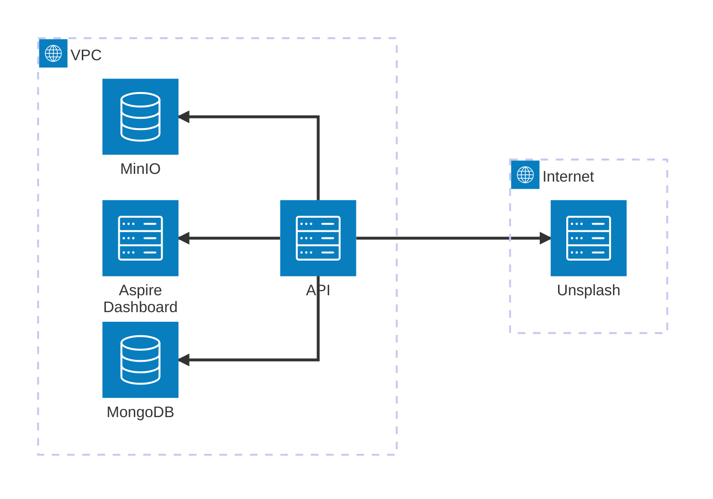

*Spotkajnik to aplikacja, która zamienia pomysły na wspólne wyjścia w realne spotkania. Niezależnie od tego, czy chcesz zaprosić znajomych na wspólny wieczór, czy poznać nowych ludzi o podobnych zainteresowaniach — tu znajdziesz przestrzeń do działania.*

*Masz pomysł na ciekawe wydarzenie? Dodaj je i zobacz, kto się dołączy. A może chcesz gdzieś wyjść, ale nie masz z kim? Zobacz, co dzieje się wokół Ciebie i dołącz do czegoś, co Cię zainteresuje.*

*Spotkajnik to Twój sposób na więcej okazji do aktywnego spędzania czasu w towarzystwie. Pobierz aplikację i przekonaj się, jak łatwo można spotykać się w prawdziwym życiu.*

---

# 📌 Przydatne linki
- 🌍 Aspire Dashboard: http://10.114.0.2:18888
- ⚙️ Minio Console: http://10.114.0.5:9001
- 📊 Access Server client portal: https://164.90.210.100

# Diagram architektury środowiska `Staging`

