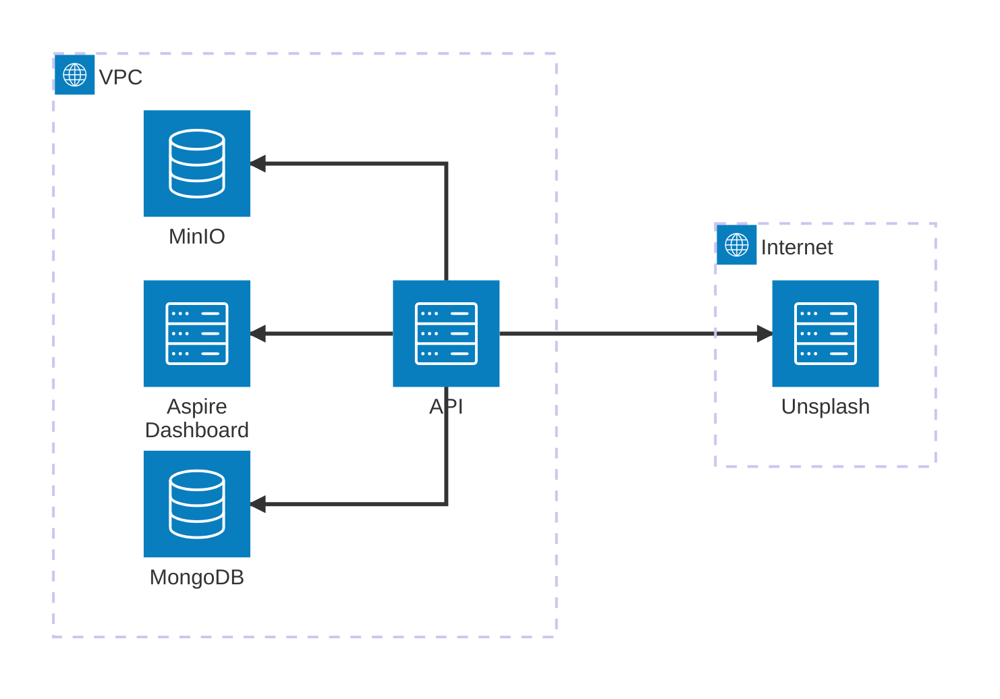

# 📌 Przydatne linki
- 🌍 Aspire Dashboard: http://10.114.0.2:18888
- ⚙️ Minio Console: http://10.114.0.5:9001
- 📊 Access Server client portal: https://164.90.210.100

# Diagram architektury środowiska `Staging`

